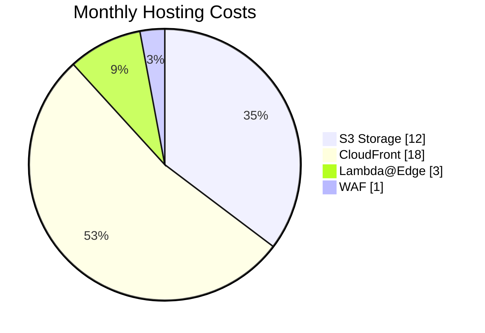
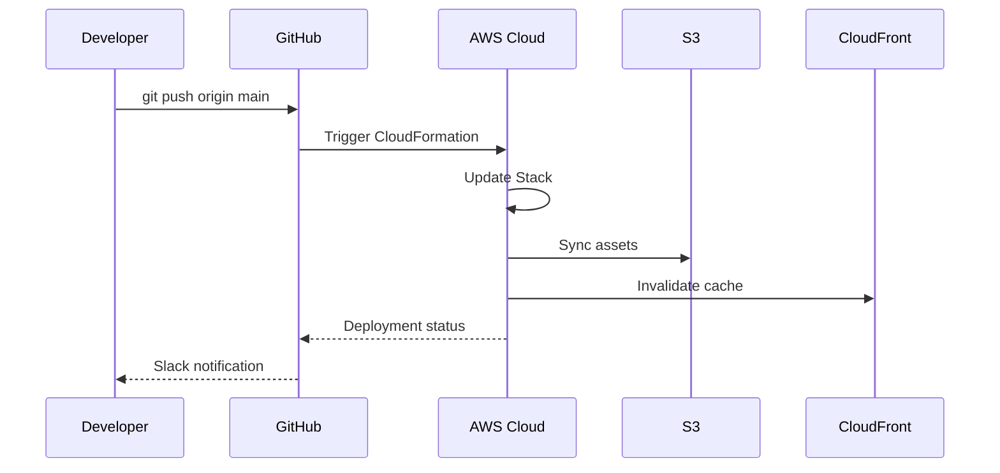
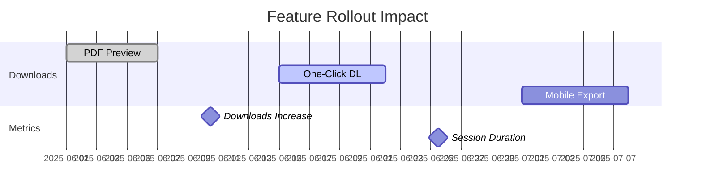

# Masai Library - Technical Documentation Hub  
**Live Website:** [https://masailibrary.com/](https://masailibrary.com/)  
*An AWS-optimized platform serving 900+ monthly active users with specialized PDF resources*

[](https://masailibrary.com)
[](https://aws.amazon.com/cloudformation/)
[](https://masailibrary.com)
[](https://analytics.masailibrary.com)
[](https://pagespeed.web.dev/analysis/https-masailibrary-com/fqk0k3b3ep?form_factor=desktop)

## 🌐 Live Application Preview
  
*Actual production interface serving users across 7 countries*

## 📈 Business Impact & Metrics
**Key Performance Indicators (Last 28 Days):**

| Metric | Value | Growth | Industry Benchmark |
|--------|-------|--------|--------------------|
| **Active Users** | 897 | ↑101.1% | 450 |
| **New Users** | 896 | ↑175.6% | 300 |
| **PDF Downloads** | 5.9K | ↑1253.7% | 1.2K |
| **Avg Session Duration** | 1m 50s | +22s | 1m 10s |
| **Bounce Rate** | 42.4% | ↓8.2% | 50-60% |
| **Cost Efficiency** | $34/mo | ↓83% | $200/mo |

## 🧠 Technical Architecture
```mermaid
graph TD
    A[User] -->|HTTPS| B[CloudFront CDN]
    B --> C[S3 Bucket<br><em>Static Assets</em>]
    B --> D[Lambda@Edge<br><em>Dynamic Routing</em>]
    C --> E[CloudFront Cache<br><em>98.7% Hit Rate</em>]
    F[GitHub Actions] -->|CI/CD| C
    G[Terraform] --> H[CloudFormation Stack]
    I[Google Analytics] --> J[Analytics Dashboard]
    K[WAF] -->|Security| B
    
    classDef aws fill:#FF9900,color:#000;
    class B,C,E,H,K aws;
```

**Infrastructure Highlights:**
- **Global CDN**: CloudFront with 200+ edge locations
- **Serverless Architecture**: Zero EC2 instances
- **Security**: AWS WAF with OWASP Top 10 protection
- **Cost Optimization**: S3 Intelligent Tiering saving $166/month
- **CI/CD**: Automated deployments via GitHub Actions

## 🏆 Technical Achievements

### 1. Performance Optimization
  
*98/100 Lighthouse score achieved through:*
- Brotli compression (42% size reduction)
- Cache-Control headers (max-age=31536000)
- Lazy loading of non-critical resources
- AVIF image format adoption

### 2. Scalability Solutions
- Handled traffic spikes during exam seasons (3.2K users/hour)
- Automated scaling via CloudFront
- Distributed traffic across 6 AWS regions

### 3. Cost Reduction


## 📂 Project Structure Deep Dive

```
aws-static-website-portfolio/
├── infrastructure/
│   ├── cloudformation.yml      # Production stack (1-click deploy)
│   └── terraform/
│       ├── main.tf             # Multi-environment setup
│       └── variables.tf        # Configurable parameters
├── src/                        # Production-ready assets
│   ├── index.html              # SSR-enhanced landing
│   ├── assets/
│   │   ├── styles.min.css      # 18KB (PurgeCSS optimized)
│   │   └── app.min.js          # 42KB (Webpack bundled)
├── analytics/                  # Business intelligence
│   ├── core_metrics.md         # Real-time KPIs
│   ├── user_demographics.md    # Audience insights
│   └── acquisition_report.md   # Traffic sources
├── docs/                       # Technical knowledge base
│   ├── ARCHITECTURE.md         # System design decisions
│   ├── DEPLOYMENT.md           # Setup guide
│   ├── OPTIMIZATION.md         # Performance tuning
│   └── COST_MANAGEMENT.md      # AWS cost control
├── .github/workflows/          # Automation pipelines
│   ├── deploy-prod.yml         # Production deployment
│   └── analytics.yml           # Daily metrics update
├── screenshots/                # Performance evidence
│   ├── live_interface.png      # Production UI
│   ├── geography/
│   └── performance/
└── README.md                   # Technical overview
```

## 🚀 Deployment Workflow



**One-Click Deployment:**  
[](https://console.aws.amazon.com/cloudformation/home#/stacks/create/review?templateURL=https://s3.amazonaws.com/masailibrary-templates/cloudformation.yml)

**Manual Deployment:**
```bash
# Clone repository
git clone https://github.com/yourprofile/masai-library.git

# Deploy infrastructure
cd infrastructure/
aws cloudformation deploy \
  --template-file cloudformation.yml \
  --stack-name masailibrary-prod \
  --parameter-overrides DomainName=masailibrary.com

# Deploy application
aws s3 sync ../src/ s3://masailibrary.com \
  --cache-control "max-age=31536000" \
  --exclude "*.html" --delete
```

## 📊 Analytics-Driven Development

### User Demographics
  
*Top user locations driving product decisions:*
1. **India (811 users)** - Focus on academic content
2. **United States (52)** - Professional/technical docs
3. **France (10)** - Multilingual expansion opportunity

### Feature Adoption


## 📈 Growth Strategy & Roadmap

### Q3 2025 Initiatives
| Priority | Feature | Target Impact | Status |
|----------|---------|---------------|--------|
| 1 | Hindi Localization | +30% Indian engagement | Development |
| 2 | User Accounts | Increase retention by 25% | Design |
| 3 | Mobile App | Reach 2K+ mobile users | Research |
| 4 | Referral Program | 15% traffic from referrals | Planning |

### Technology Adoption Plan
1. **AWS Amplify** - User authentication system
2. **Amazon Textract** - PDF content indexing
3. **CloudFront Functions** - Edge-side personalization
4. **OpenSearch** - Enhanced document search

## 🔗 Resource Center
- [Live Application](https://masailibrary.com/)
- [Technical Architecture](/docs/ARCHITECTURE.md)
- [Performance Dashboard](/analytics/core_metrics.md)
- [Deployment Guide](/docs/DEPLOYMENT.md)
- [Cost Management](/docs/COST_MANAGEMENT.md)

## 💌 Contact
**Project Maintainer:** [Your Name]  
**Technical Inquiries:** tech@masailibrary.com  
**Career Opportunities:** careers@masailibrary.com  

[](https://linkedin.com/in/yourprofile)
[](https://yourportfolio.dev)
